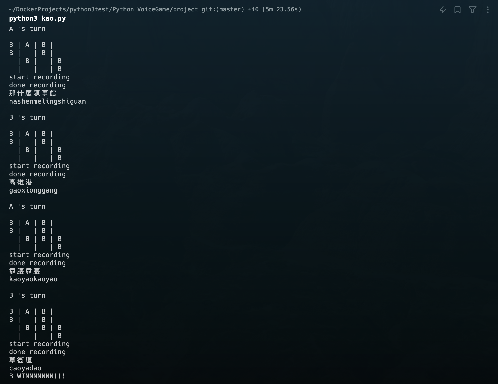

> Python 程式設計 - 高雄地名有意義又真好 pin )☁️🎉
> 

<p align="center">
    
    <br />
    <br />
    <b>利用 pyaudio 錄製語音，speech_recognition 將語音檔轉成文字</b>
    <br />
    <b>最後判斷玩家的語音內容是否符合賓果圖上的地名，最先連線的獲勝</b>
    <br />
    <b>一個高雄地名的賓果遊戲，玩家利用語音輪流進行賓果</b>
    <br />
    <br />
</p>

[](https://img.shields.io/badge/Language-Python-blue) 

## 安装

在本機安裝相關依賴

### Unix

```bash
# 主程式需要的相關套件
pip install SpeechRecognition pyaudio pygame xpinyin
# 安裝 FLAC，FLAC（Free Lossless Audio Codec）是一種音頻編碼格式
# Linux
sudo apt-get install flac
# macOS
brew install flac
# 確認是否已經安裝成功
flac
```

